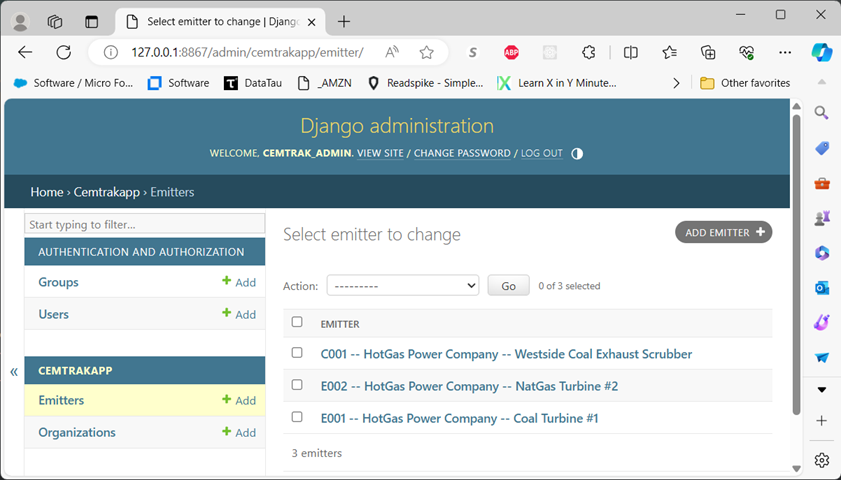

# CemTrak -- An Open Source Carbon Emissions Tracker

### A polyglot project, using multiple technologies and programming languages

### 4 main parts:
- IN-PROCESS: This Django (Python) web app for managing Organizations and their carbon Emitters
- IN-PROCESS: [A Fastify (Nodejs, Javascript) REST API](https://github.com/mring33621/cemtrak_event_log) for logging emitter time series data
- IN-PROCESS: [A FastAPI (Python) REST API](https://github.com/mring33621/cemtrak_analytics_api) for querying and analyzing the emitter data
- TODO: A web front end for visualizing the emitter data

### Details:
- Organizations have many Emitters
- Emitters have a name, an external ID and carbon emission specs for high, medium, low and off states
- Normally, Emitters add carbon to the atmosphere
- A special case of Emitters, called Compensators, remove carbon from the atmosphere
- A Compensator might be a scrubber device or the purchase of carbon offsets
- GET views for /cemtrakapp/organizations/datadump and /cemtrakapp/emitters/datadump, to allow easy, read-only, CSV access to the respective data.
